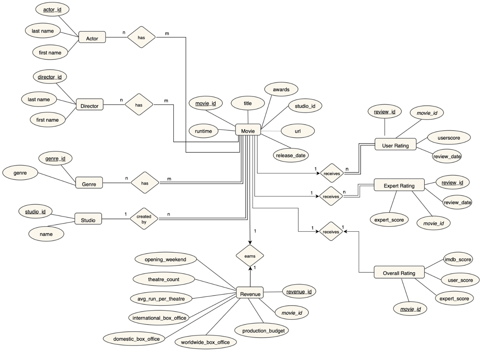

# Movie box office database
PostgreSQL and Python course project with a shared team Encapsulator, 13-table schema, reproducible final-CSV import and real integration evidence. Original attributed work: Jonas SQ1, Nethmi SQ2, Amanda SQ3 and SQ4 setup. The active SQ4a is Nethmi's supplied script; SQ4b is excluded from this delivery.

Current technical evidence: [59/59 checks on the chosen schema and supplied SQ4a](tests/INTEGRATION_RESULTS.md). These are agent-run checks. Final student review, private data delivery remain pending. Earlier audit reports describe historical states and are not the current execution status.

## Reproduce the integration
Run from the repository root. PostgreSQL must be running, and the configured local role must be allowed to create a database. Obtain the authorized private package containing `data/private/` through the agreed course submission route.

```bash
python3 -m venv .venv
.venv/bin/python -m pip install -r python/requirements.txt
export PGHOST=127.0.0.1
export PGPORT=5432
# Set PGUSER and PGPASSWORD only if your local role requires them.
export PGDATABASE=movies_codex_test_your_unique_name
.venv/bin/python scripts/rebuild_database.py --data-dir data/private --database "$PGDATABASE"
.venv/bin/python scripts/integration_test.py --output-dir tests/evidence/local --private-export-dir private_exports --test-threshold-update
```

The build refuses to replace an existing database and verifies all CSV hashes, headers and row counts. If the name already exists, choose a new name. For read-only checks on an existing database, set PGDATABASE to that name and omit `--test-threshold-update`.

Open `python/shared/HeyEncapsulator.ipynb` from the repository root in a Python notebook environment, or import `MovieDB` from `python/shared/movie_db.py`. There are 10 extraction methods plus a threshold setter. Notebook output and CSV integration results are based on real execution, not syntax checking alone.

## Evidence and submission
- [Actual integration results](tests/INTEGRATION_RESULTS.md)
- [Contribution provenance](docs/CONTRIBUTIONS.md)
- [Native GitHub Projects board](https://github.com/users/Amandalaura04/projects/3) and [evidence-linked task overview](scrum/SCRUM_BOARD.md)
- [Final submission checklist](docs/INTEGRATION_STATUS.md)
- [SQL run order](sql/RUN_ORDER.md)
- [Data manifest and private delivery](data/README.md)

The public repository excludes raw course CSVs, private student logbooks, passwords and full record-level exports. The private package contains those final database CSVs, full extraction CSVs and a database backup, with no stored database password. The lecturer still needs access through an allowed private submission route. Historical audits in tests describe their original point-in-time limitations; the integration results document records current execution evidence.

Remaining human requirements: independent student verification and explanation of code; private data delivery. This repository does not certify a final grade or claim unobserved individual work.

The active schema uses expert_rating, user_rating and sales, matching the supplied table-name reference. Source CSV filenames remain unchanged and are mapped by data/manifest.json. SQ4a uses 5,645 single-sales-match films; the existing SQ3/SQ4 analysis view uses 4,143 review-eligible positive-revenue films. These samples are intentionally kept distinct.

## Database design



Conceptual ERD supplied by the team. Physical table and column names are defined in the SQL schema.
